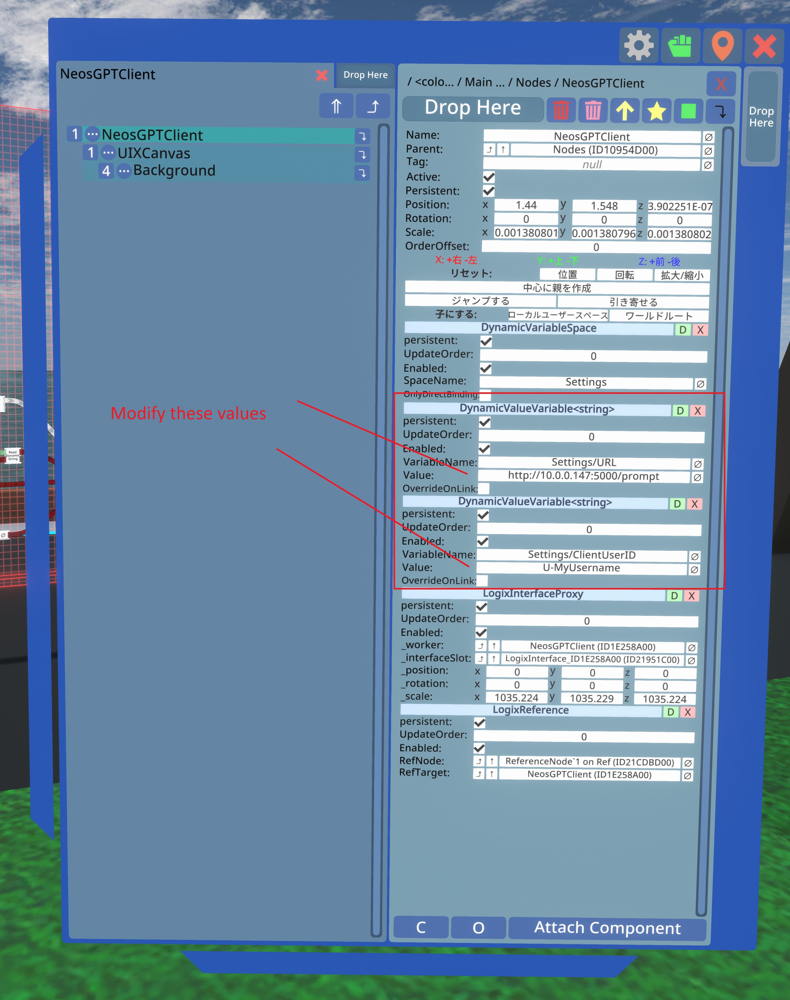
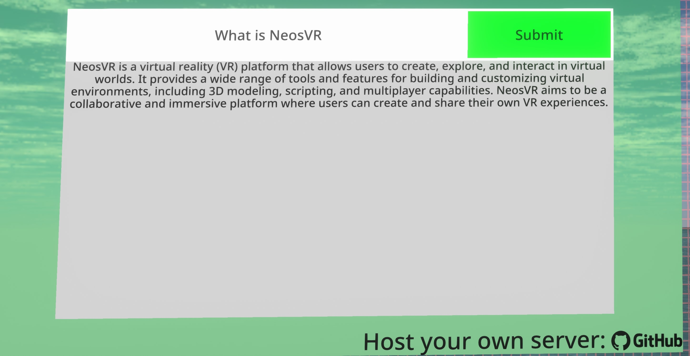

# neos-gpt
Server to facilitate consumption of the OpenAI API from NeosVR, without exposing API keys in Logix.

## Features:
* Rate limiting
* Max token limit
* Responses returned as plain text for easy consumption in Logix
* IP whitelist

## Server Setup:
1. Install Python 3
2. Install the requirements with `pip install -r requirements.txt`
3. Make a copy of `config_example.ini` and rename it to `config.ini`
4. Open `config.ini` in a text editor and enter your OpenAI API key to the api_key section. 
Change any other options as you see fit. Set `host` to `localhost` if testing locally. 
If you want the server to be accessible to the internet, set `host` to `0.0.0.0`
5. Run `python main.py` to start the server. The server will be hosted on the host and port you specified in `config.ini`

With the default configuration, you can test the server with Postman by making a POST HTTP request to your server at:
http://localhost:5000/prompt
and enter your prompt as raw text in the request body.

If you want to run on a headless linux EC2 instance, you can create a service for the server.
Look at neos_gpt_server.service as an example, changing the ExecStart and WorkingDirectory values as needed.
Then copy the service file to `/etc/systemd/system/` and run:

* `sudo systemctl daemon-reload` to reload service files
* `sudo systemctl start neos_gpt_server.service` to start the service
* `sudo systemctl enable neos_gpt_server.service` to enable the service to start on boot (optional)

## Client Setup in NeosVR:
1. This public folder contains the client:
`neosrec:///U-DingoYabuki/R-9793cb26-f9ac-4eea-b52d-1bafdff8e502`
Copy this URI and paste it into Neos, and the public folder will spawn. 
The client item is in the folder, named `NeosGPTClient`. 
2. Spawn the item and navigate to the root of it with your Inspector tool.
3. You will see 2 `DynamicValueVariable<string>` components with VariableNames `Settings/URL` and `and Settings/ClientUserID`. Modify those components' values to match your server's URL and your Neos UserID.

Now your client has been configured. It will only work when you are in a session, and connect to your server, using your OpenAI API key. When other users send prompts, the requests will be sent to your server on your behalf. There is no need for other users to connect to your server.

